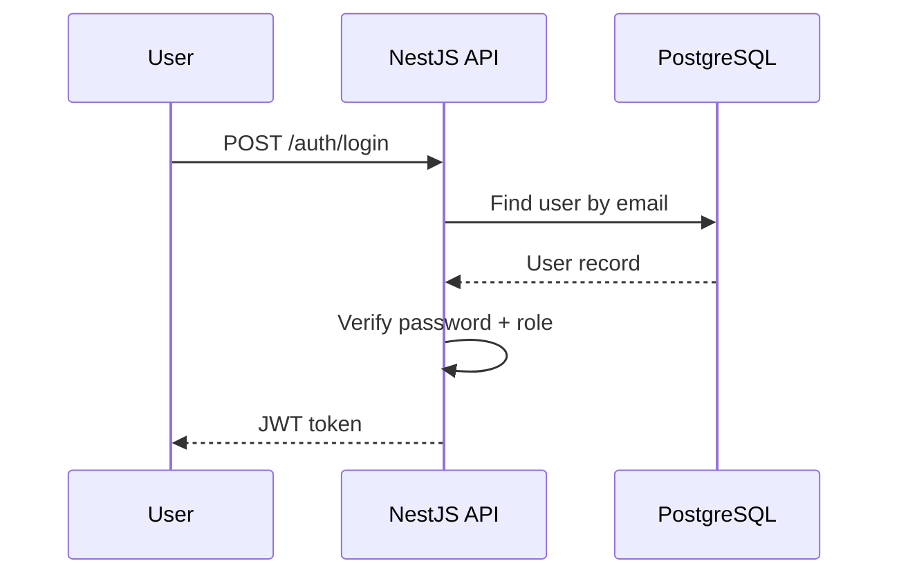

# Backend Architecture

## Service Architecture

**Controller/Route Organization**
```text
apps/api/src/
  modules/
    auth/
      auth.controller.ts
      auth.service.ts
      auth.module.ts
    users/
      users.controller.ts
      users.service.ts
      users.module.ts
    company/
      company.controller.ts
      company.service.ts
      company.module.ts
    freelancer/
      freelancer.controller.ts
      freelancer.service.ts
      freelancer.module.ts
    jobs/
      jobs.controller.ts
      jobs.service.ts
      jobs.module.ts
    applications/
      applications.controller.ts
      applications.service.ts
      applications.module.ts
    messages/
      messages.controller.ts
      messages.service.ts
      messages.module.ts
    admin/
      admin.controller.ts
      admin.service.ts
      admin.module.ts
  common/
    guards/
    decorators/
    filters/
```

**Controller Template**
```typescript
@Controller("jobs")
export class JobsController {
  constructor(private readonly jobsService: JobsService) {}

  @Get()
  list(@Query() query: ListJobsDto) {
    return this.jobsService.list(query);
  }

  @Post()
  @UseGuards(JwtAuthGuard, RolesGuard)
  @Roles("company")
  create(@Body() dto: CreateJobDto, @Req() req: Request) {
    return this.jobsService.create(req.user.id, dto);
  }
}
```

## Database Architecture

**Schema Design**
```sql
-- See Database Schema section above
```

**Data Access Layer**
```typescript
@Injectable()
export class JobsRepository {
  constructor(private readonly prisma: PrismaService) {}

  async list(filters: ListJobsDto) {
    return this.prisma.job.findMany({
      where: { status: "open" },
    });
  }
}
```

## Authentication and Authorization

**Auth Flow**


**Middleware/Guards**
```typescript
@Injectable()
export class JwtAuthGuard extends AuthGuard("jwt") {}

@Injectable()
export class RolesGuard implements CanActivate {
  canActivate(context: ExecutionContext): boolean {
    const req = context.switchToHttp().getRequest<Request>();
    const required = this.reflector.get<string[]>("roles", context.getHandler()) || [];
    return required.length === 0 || required.includes(req.user.role);
  }
}
```
