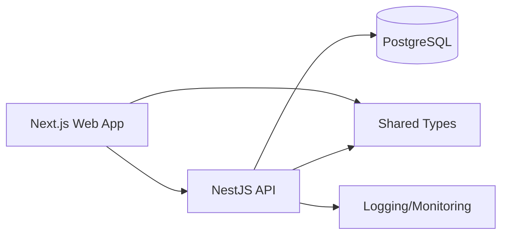

# Components

## Web App (Next.js)
**Responsibility:** User-facing UI for onboarding, profiles, jobs, applications, and messaging.
**Key Interfaces:**
- `/` landing, `/auth` login/register
- `/company/*`, `/freelancer/*` role-based dashboards
**Dependencies:** API service layer, shared types
**Technology Stack:** Next.js 14, React, Tailwind, Radix UI

## API Service (NestJS)
**Responsibility:** Core business logic and REST endpoints for all domain flows.
**Key Interfaces:**
- `/auth/*`, `/company/profile`, `/freelancer/profile`, `/jobs`, `/applications`, `/messages`
**Dependencies:** PostgreSQL, Auth/JWT, shared types
**Technology Stack:** NestJS 10, TypeScript

## Database (PostgreSQL)
**Responsibility:** Persistent storage for users, profiles, jobs, applications, messages, admin actions.
**Key Interfaces:**
- SQL schema with relational constraints
**Dependencies:** NestJS data layer
**Technology Stack:** PostgreSQL 16

## Shared Types Package
**Responsibility:** Shared TypeScript interfaces and DTOs between web and API.
**Key Interfaces:**
- `User`, `CompanyProfile`, `FreelancerProfile`, `Job`, `Application`, `Message`
**Dependencies:** Apps import via workspace package
**Technology Stack:** TypeScript, npm workspaces

## Auth Module
**Responsibility:** JWT-based auth and role-based guards.
**Key Interfaces:**
- JWT issuance, role guards, auth middleware
**Dependencies:** Users table, bcrypt
**Technology Stack:** NestJS Auth module

## Component Diagram

