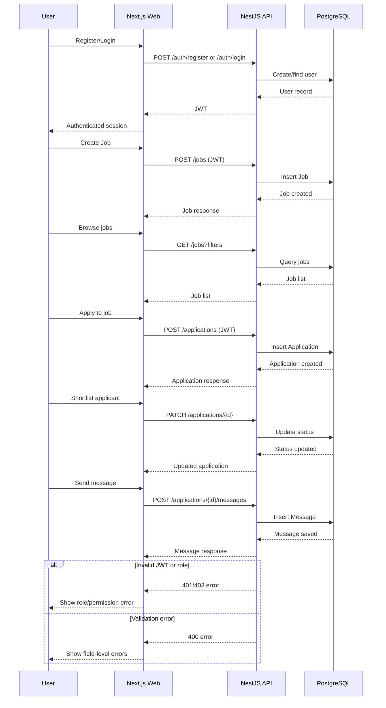

# Core Workflows

```mermaid
sequenceDiagram
  participant U as User
  participant Web as Next.js Web
  participant API as NestJS API
  participant DB as PostgreSQL

  %% Auth
  U->>Web: Register/Login
  Web->>API: POST /auth/register or /auth/login
  API->>DB: Create/find user
  DB-->>API: User record
  API-->>Web: JWT
  Web-->>U: Authenticated session

  %% Job posting
  U->>Web: Create Job
  Web->>API: POST /jobs (JWT)
  API->>DB: Insert Job
  DB-->>API: Job created
  API-->>Web: Job response

  %% Browse/apply
  U->>Web: Browse jobs
  Web->>API: GET /jobs?filters
  API->>DB: Query jobs
  DB-->>API: Job list
  API-->>Web: Job list
  U->>Web: Apply to job
  Web->>API: POST /applications (JWT)
  API->>DB: Insert Application
  DB-->>API: Application created
  API-->>Web: Application response

  %% Shortlist + message
  U->>Web: Shortlist applicant
  Web->>API: PATCH /applications/{id}
  API->>DB: Update status
  DB-->>API: Status updated
  API-->>Web: Updated application
  U->>Web: Send message
  Web->>API: POST /applications/{id}/messages
  API->>DB: Insert Message
  DB-->>API: Message saved
  API-->>Web: Message response

  %% Error handling
  alt Invalid JWT or role
    API-->>Web: 401/403 error
    Web-->>U: Show role/permission error
  else Validation error
    API-->>Web: 400 error
    Web-->>U: Show field-level errors
  end
```
