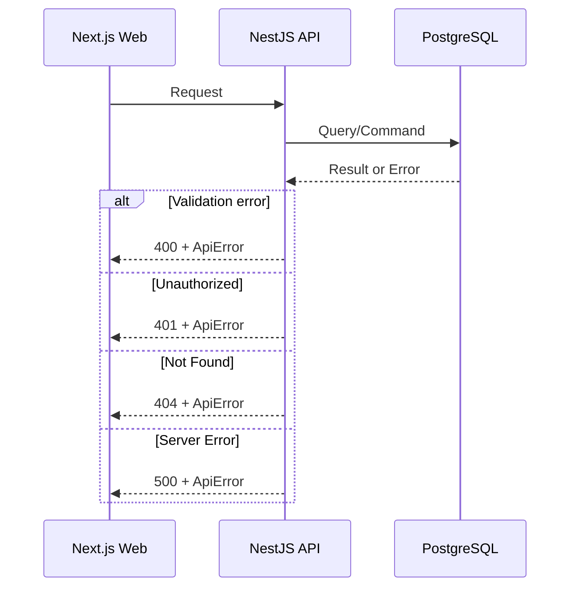

# Error Handling Strategy

## Error Flow


## Error Response Format
```typescript
interface ApiError {
  error: {
    code: string;
    message: string;
    details?: Record<string, any>;
    timestamp: string;
    requestId: string;
  };
}
```

## Frontend Error Handling
```typescript
export function normalizeApiError(err: unknown): ApiError {
  if (typeof err === "object" && err && "error" in err) {
    return err as ApiError;
  }
  return {
    error: {
      code: "UNKNOWN",
      message: "An unexpected error occurred.",
      timestamp: new Date().toISOString(),
      requestId: "unknown",
    },
  };
}
```

## Backend Error Handling
```typescript
@Catch()
export class ApiExceptionFilter implements ExceptionFilter {
  catch(exception: unknown, host: ArgumentsHost) {
    const ctx = host.switchToHttp();
    const res = ctx.getResponse<Response>();
    const req = ctx.getRequest<Request>();
    const status = exception instanceof HttpException ? exception.getStatus() : 500;

    res.status(status).json({
      error: {
        code: exception instanceof HttpException ? exception.name : "INTERNAL_ERROR",
        message: exception instanceof HttpException ? exception.message : "Internal server error",
        details: exception instanceof HttpException ? exception.getResponse() : undefined,
        timestamp: new Date().toISOString(),
        requestId: req.headers["x-request-id"] || "unknown",
      },
    });
  }
}
```
