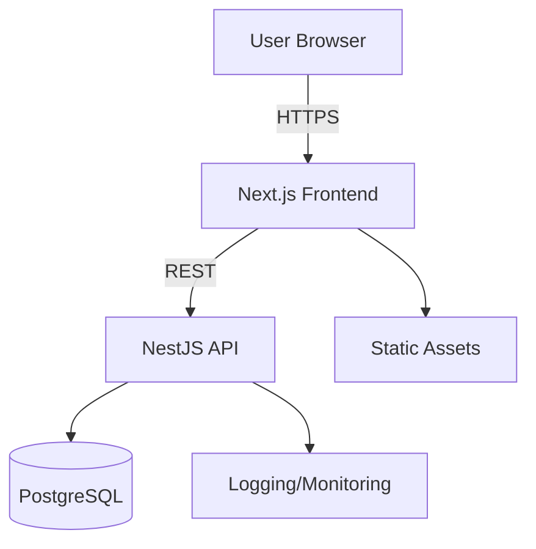

# High Level Architecture

## Technical Summary
A monolithic NestJS REST API paired with a Next.js web frontend delivers the MVP with clear role separation and secure JWT-based access. The system deploys as a single fullstack monorepo to optimize speed of iteration and maintain shared types between frontend and backend. Core flows - profiles, jobs, applications, and messaging - are served via a REST API backed by PostgreSQL. The platform targets a professional, trust-oriented web experience with fast page loads and restrained UI. This architecture aligns to the PRD goals of rapid validation and minimal operational complexity.

## Platform and Infrastructure Choice
Option A: **Heroku (Apps + Heroku Postgres)**
Pros: Simple fullstack deployment, managed Postgres, minimal ops overhead.
Cons: No built-in edge CDN; cost can rise with scale.

Option B: **Render (Web + Managed Postgres)**
Pros: Simple deployment and reasonable pricing.
Cons: Less mature ecosystem than Heroku.

Option C: **AWS (ECS/Fargate + RDS + CloudFront)**
Pros: Enterprise-grade scalability and control.
Cons: Overkill for MVP; higher ops cost and complexity.

**Recommendation:** Option A (Heroku) to minimize operational overhead for MVP.

**Platform:** Heroku
**Key Services:** Heroku app hosting (web + api), Heroku Postgres, basic logs/metrics
**Deployment Host and Regions:** Single region (default to US-East unless user specifies)

## Repository Structure
**Structure:** Monorepo
**Monorepo Tool:** npm workspaces
**Package Organization:** `apps/web` (Next.js), `apps/api` (NestJS), `packages/shared` (types/utilities)

## High Level Architecture Diagram

## Architectural Patterns
- **Monolithic Fullstack:** Single backend service with clear modules - _Rationale:_ Minimizes complexity and accelerates MVP delivery.
- **Component-Based UI:** React components in Next.js - _Rationale:_ Maintainable, reusable UI with clear separation of concerns.
- **REST API with JWT:** Standardized endpoints and role-scoped access - _Rationale:_ Simple, interoperable, aligns to PRD.
- **Repository Pattern (Data Access):** Encapsulated DB access - _Rationale:_ Improves testability and enables future DB flexibility.
- **Shared Types Package:** Shared TypeScript models - _Rationale:_ Prevents schema drift between frontend and backend.
